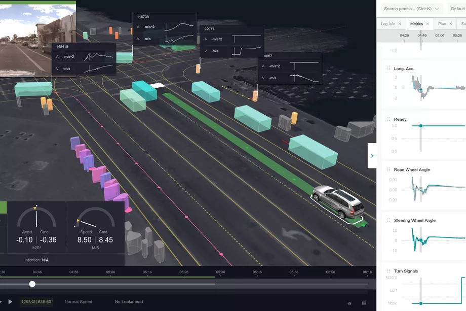
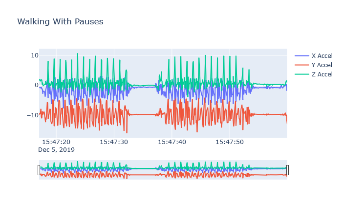
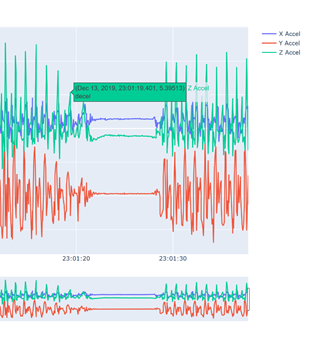
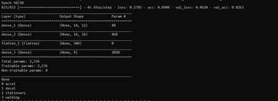

# Overview

DARPA’s Grand Challenge in the early 2000’s kick-started an aggressive pursuit (by technology and automotive companies alike) of driverless cars. These vehicles face a myriad of challenges in urban settings however, chief among them are ensuring safe interactions with pedestrians. Most state-of-the-art autonomous vehicles use a combination of radar, LIDAR, and cameras to detect and track pedestrians. A significant amount of work has focused on inferring pedestrian intent (e.g., predicting when a person will attempt to cross a roadway) using machine learning-based computer vision techniques. One issue with these approaches is that sensors they rely upon may be unusable in certain weather and lighting conditions. Autonomous systems should always be built with redundancy in mind, by utilizing an array of techniques and sensors to ensure safety and reliability. To that end, this work discusses a novel algorithm for predicting a pedestrian's intent to cross a roadway. This algorithm would be capable of running on modern smartphones and broadcasting pedestrian intent information to nearby vehicles. When incorporated with existing techniques for pedestrian crossing inference, this new approach produces would lead to a more robust pedestrian inference system for autonomous vehicles.

# Introduction

Elon Musk, the CEO and founder of Tesla Motors, an upstart electric car company, once proclaimed that “Lidar is a fool’s errand. Anyone relying on lidar is doomed. Doomed! [They are] expensive sensors that are unnecessary.” (Burns). Instead, Tesla uses a combination of radar sensors and high definition cameras on their vehicles to deliver their autonomous driving solution, AutoPilot. Google’s Waymo and General Motor’s Cruise Automation on the other hand use LIDAR as the core component of their vehicles. No matter the sensor, many of the current generation of driverless vehicles struggle in low light and inclement weather conditions. The major infrastructure Google has built over the past few years with Waymo is impressive to say the least, but it is situated mostly in the suburbs of Phoenix, Arizona.

Figure 1 – A Cruise Automation Vehicle LIDAR Visualization
Source: https://www.theverge.com/2019/2/19/18229397/uber-gm-cruise-av-visualization-open-source 

The area sees very little rainfall and “…also has relatively low winds and a temperature range that is conducive to completing regulatory tests almost every day of the year…” according to a Toyota official (Zappala). Inclement weather can impair the vehicle’s ability to make sense of the world around it occluding sensor data, and in some cases sensor data from the vehicle only is not enough to make a determination. In early 2018, an Uber self-driving vehicle struck and killed a jaywalking pedestrian late at night. According to the National Transportation Safety Board (NTSB) “the SUV had "a fusion" of three sensor systems — radar, lidar and a camera — designed to detect an object and determine its trajectory. However, the system could not determine whether Herzberg was a pedestrian, vehicle, or bicycle. It also failed to correctly predict her path.” “The system design did not include a consideration for jaywalking pedestrians.” In this case sensor fusion and the underlying algorithms were not enough to prevent a catastrophe, but with the prevalence of smartphones with human activity recognition algorithms like the one we propose, we can make the road safer for everyone. 

## Factoring in the Pedestrian

Android and iOS devices support basic human activity detection. That is, the ability to discern if a user is stationary, walking, running, driving, etc. Our goal here is similar. We attempted to develop a neural network that could discern if a user was exhibiting crossing behaviors orthogonal to their previous activity. We make the assumption that in most cases the user starts stationary at a destination and begins walking towards their destination. We hypothesize that the common behaviors pedestrians exhibit before crossing can be picked by the inertial sensors in a smartphone.

# Data Collection

We began by collecting data one of the following features/behaviors that pedestrian would likely exhibit before crossing the street.

## Feature Overview

### Looking Both Ways Before Crossing

As a kid you were likely taught (or quickly learned) this basic behavior. Everyone should slow down and look both ways before crossing the street. We can visualize this by plotting the accelerometer readings for a short walk. 

Figure 2 – Looking Both Ways Before Crossing Visualization 

As we begin walking there is an initial acceleration from a stationary position. Then we get into our normal stride, but as we get close to the intersection (roughly the center of the image above), we slow down to look (and in some cases may even be stationary for a few seconds) then speed back up to get across the street safely. This pattern diverges slightly from your normal walking pattern and therefore combined with GPS data to confirm proximity to an intersection, and/or another of the behaviors below, is a key indicator of crossing.

### Curb Your Enthusiasm

Figure 3- Android Device Axis
Source: https://developer.android.com/reference/android/hardware/SensorEvent

Jaywalking pedestrians are by definition not crossing at the crosswalk. They are likely crossing at another point in the road, and likely stepping off the curb to do so. This quick bit of acceleration in the vertical Y-axis could also be easily picked up by an accelerometer. Specifically, stepping down from the curb produces a change in the Y-component, while you get a slight acceleration in the Z-component as one moves forward.

### About Face

As a pedestrian approaches a crosswalk, they may need to turn to face the street/crosswalk. This feature would require data from the gyroscopic along with GPS and compass data to confirm a pedestrian’s heading.

## Methodology

Figure 4- Labeled Feature

We began by developing an Android application that would collect accelerometer, gyroscope, and magnetometer (compass) data at approximately 20Hz, or about 20 sensor reports from each sensor per second. There are datasets that are used for human activity recognition that could have feasibly been used for this endeavor but re-labeling the data for the specific features we wanted to detect without full knowledge of how the data was collected would likely have been just as time consuming as just recording new data. The sort of wind-up features we wanted could likely have been pruned from the data as extra noise. A typical collection period usually involved opening the app and walking in a large environment (like a gymnasium or park) for a few moments while exhibiting a few of the behaviors above. The data was then extracted as an SQL Lite database from the device and exported to CSV. From there data was visualized, cleaned with Excel, normalized, and labeled accordingly. Cleaning consisted of simply removing information like the date and a number indicating which collection run the data was a part of. We started by tackling the first feature. We labeled acceleration, deceleration, walking, and stationary behavior in our dataset. For instance, a pedestrian was considered to be decelerating if their acceleration had been decreasing for a majority (11 out of 20) sensor reports, accelerating if their acceleration had been increasing for the same majority of sensor reports, stationary if their acceleration was near zero, and walking if their acceleration followed a pattern of fluctuation. Unfortunately, it was a little difficult to exhibit acceleration and deceleration for 20 sensor reports exactly (again the timespan of approximately 1 second), and acceleration and deceleration ended up being minority classes which later made our neural network more difficult to train.

# Network Architecture

All models for this project were constructed using Keras and TensorFlow. We explored two different network architectures for the model. We began with a simple deep neural network composed of 2 layers. The first layer after the input layer contained 12 nodes, and the second 36 nodes. 

Figure 5- Model Architecture and Accuracy

This simple network yielded a validation accuracy of roughly 80% after training for 50 epochs. The validation accuracy seemed impressive at first for such a simple network, with little overfitting. Adding more layers or neurons revealed a disturbing trend, however. Adding a third layer with a few more neurons than the second made apparent that the network was essentially learning that roughly 70-80% of the dataset was walking and then overfitting to the rest of the data. This made hyperparameter tuning extremely tedious because adding layers and neurons after a certain point would overfit on the validation data, but it was an incredibly difficult pinpoint the exact number. Keras’ validation split parameter helped reduce the overfitting in some instances but was not a panacea. In the future, we likely need to do oversampling on the acceleration and deceleration features or apply higher class weights to those two labels. We also explored a convolutional neural network composed of two convolutional layers, 2 max pooling layers, and one small dense layer with a number of filters and nodes similar to the basic DNN. The CNN performed marginally better than the DNN, but still suffered from the same problem of overfitting due to an imbalanced dataset.

# Conclusion

Ultimately, the network architectures here we explored seemed capable of modeling the problem, but the dataset (and perhaps data collection practices at large) we were not conducive to favorable a result. This data could be communicated to driverless cars and fused with other sensor data from the car itself to provide a clearer picture of the car’s surroundings. Further explorations of the features and concepts presented here should use a more methodical method for collecting data. A treadmill would likely be the best way to collect the data since the acceleration and deceleration periods can be drawn out over time and researchers can standardize walking and acceleration/deceleration speeds. The results here show that the problem is again, not necessarily intractable, and given our initial only cursory understanding of neural networks, the results achieved here were promising. Future researchers should also increase the reporting rate of the smartphone’s inertial sensors (if supported). A few other researchers used 20Hz, but most used 50Hz, which could yield more accurate results down the road. If anything, this research highlights the importance of good data collection practices when investigating a machine learning based solution. Hopefully the conclusions and lessons learned here present a starting point for future researchers.

# Works Cited

Burns, Matt. “'Anyone Relying on Lidar Is Doomed,' Elon Musk Says.” TechCrunch, TechCrunch, 22 Apr. 2019, https://techcrunch.com/2019/04/22/anyone-relying-on-lidar-is-doomed-elon-musk-says/.

Zappala, Ottavia. “Why Automakers Flock to Arizona to Test Driverless Cars.” *USA Today*, Gannett Satellite Information Network, 26 Dec. 2017, https://www.usatoday.com/story/money/cars/2017/12/26/why-automakers-flock-arizona-test-driverless-cars/981840001/. 

Gonzales, Richard. “Feds Say Self-Driving Uber SUV Did Not Recognize Jaywalking Pedestrian In Fatal Crash.” *NPR*, NPR, 8 Nov. 2019, https://www.npr.org/2019/11/07/777438412/feds-say-self-driving-uber-suv-did-not-recognize-jaywalking-pedestrian-in-fatal-.
